# Malaria Data Quality Dashboard

## Introduction

The WHO Malaria Data Quality (DQ) dashboard is an addendum to the [malaria burden reduction aggregate package](https://dhis2.org/who-package-downloads/#malaria). Like all the aggregate packages, this has been developed as an installable solution for countries to update their DHIS2-based HMIS, specifically the malaria aggregate indicators and dashboard.

This chapter provides an overview of the design principles that have been applied within the core DHIS2 features for monitoring and improvement of data quality through DHIS2 dashboards. This dashboard complements other DHIS2 apps and tools such as the [WHO Data Quality App for DHIS2](https://docs.dhis2.org/en/use/optional-apps/who-data-quality-tool/installation-and-configuration.html). This document is intended for use by DHIS2 implementers at country and regional level to be able to support implementation and localization of the package and this package can be adapted to local needs and national guidelines.

The objectives of the data quality dashboard are to:

1. Bring key data quality metrics to the users routinely through use of DHIS2 dashboards to facilitate data quality improvement activities;
2. Monitor completeness and timeliness of reporting malaria data;
3. Monitor completeness of reporting of core malaria data variables in the monthly health facility reporting form;
4. Monitor internal consistency between variables to detect inconsistencies for quality improvements;
5. Compare trends of key malaria indicators at the various reporting levels and rapidly detect anomalies as red flags for poor data quality.

The system design builds upon existing malaria aggregate guidelines principles and information system requirements that have been developed collaboratively between the WHO and UiO since 2017. It is important to note that national guidelines and policies may vary and therefore it is recommended to adapt this package to local contexts.

## Design Summary

In the development of this configuration package, an effort has been made to follow UiO's [general design principles](https://who.dhis2.org/documentation/general_design_principles.html) and a common [naming convention](https://who.dhis2.org/documentation/naming_convention.html).

The malaria Data Quality dashboard includes:

1. Indicators: data quality indicators and other relevant indicators borrowed from malaria burden reduction package..
2. Visualizations/analytic items: charts and pivot tables to visualize indicator performance
3. Dashboard: designed to present the visuals/analytic items (charts and tables) in a logical way to users

Like all dashboard packages for DHIS2, the data visualizations are configured to display data for the organisation units for which the user has data capture access in the user configuration. In this way, the dashboard can be used at national, district or other sub-national levels to monitor data quality for the geographic area most relevant to the user. This enables actions to improve data quality to be taken as close to the point of data collection and validation as possible. Configuration of users and assignment to user groups to be able to access the dashboard should be considered within country context to ensure access is provided properly to users.

### Intended users

- Health facility users: monitor completeness and consistency of data reported from the facility, which could support onsite data reviews, checking for data quality errors and cleaning for quality improvement (according to national policies & SOPs)
- District health managers: monitor data quality and detect facilities where data quality improvement may be needed; use the dashboard to provide feedback loops to facilities and plan data quality improvement follow-ups or other technical assistance activities
- National malaria program managers: monitor data quality and develop national data quality improvement plans; understand the potential biases in the routine data set to improve their ability to analyze routine malaria data and consider data quality limitations

## Indicators

Indicators are based on the data elements included in the WHO malaria burden reduction package for HMIS, which includes a monthly aggregate dataset. These indicators are used to develop dashboard items and all indicators are assigned to the indicator group "Malaria data quality".

| name | description | Numerator Description | Denominator Description | Indicator Type | Purpose |
| --- | --- | --- | --- | --- | --- |
| MAL - Reporting Completeness (%) | Number of actual reports received divided by total number of health facilities expected to report | Number of health facilities reported | Number of health facilities expected to report | Percentage | Reporting completeness |
| MAL - Reporting timeliness (%) | Number of actual reports received on time divided by total number of health facilities expected to report | Number of health facilities reported on time | Number of health facilities expected to report | Percentage | Reporting completeness |
| MAL - Confirmed malaria cases >/= Treated with 1st line courses | Confirmed malaria cases minus confirmed malaria cases treated with 1st line treatment courses (incl ACT) | Confirmed malaria cases - cases treated with 1st line tx |1| Numerator only | Consistency between variables |
| MAL - All cause deaths > Malaria inpatient deaths | All cause deaths minus malaria inpatient deaths | All cause deaths - Malaria inpatient deaths | 1 | Numerator only | Consistency between variables |
| MAL - All cause inpatients > Malaria inpatients | All cause inpatients minus malaria inpatients | All cause inpatients - Malaria inpatients | 1 | Numerator only | Consistency between variables |
| MAL - All cause outpatients > Total malaria cases | All cause outpatients minus total malaria cases | all cause outpatients - total malaria cases | 1 | Numerator only | Consistency between variables |
| MAL - Microscopy tested >/= Microscopy positive | Cases tested for malaria with Microscopy minus microscopy positive | Microscopy tested - Microscopy positive | 1 | Numerator only | Consistency between variables |
| MAL - RDT tested >/= RDT positive | Cases tested for malaria with RDT minus RDT positive | RDT tested - RDT positive | 1 | Numerator only | Consistency between variables |
| MAL - All malaria cases actual reported (%) | Count of reported total malaria cases (confirmed + presumed) divided by actual number of reports received multiplied by 100 | Total malaria cases (confirmed + presumed) | Actual report for malaria burden reduction | Percentage | Completeness of data variables |
| MAL - All-cause death actual reported (%) | Count of reported all-cause death divided by actual number of reports received multiplied by 100 | All-cause death | Actual report for malaria burden reduction | Percentage | Completeness of data variables |
| MAL - All-cause inpatient actual reported (%) | Count of reported all-cause inpatient divided by actual number of reports received multiplied by 100 | All-cause inpatient | Actual report for malaria burden reduction | Percentage | Completeness of data variables |
| MAL - All-cause outpatient cases actual reported (%) | Count of reported all-cause outpatient cases divided by actual number of reports received multiplied by 100 | All-cause outpatient cases | Actual report for malaria burden reduction | Percentage | Completeness of data variables |
| MAL - Inpatient malaria cases actual reported (%) | Count of reported inpatient malaria cases divided by actual number of reports received multiplied by 100 | Inpatient malaria cases | Actual report for malaria burden reduction | Percentage | Completeness of data variables |
| MAL - Malaria confirmed cases actual reported (%) | Count of reported malaria confirmed cases divided by actual number of reports received multiplied by 100 | Malaria confirmed cases | Actual report for malaria burden reduction | Percentage | Completeness of data variables |
| MAL - Malaria deaths actual reported (%) | Count of reported malaria deaths divided by actual number of reports received multiplied by 100 | Malaria deaths | Actual report for malaria burden reduction | Percentage | Completeness of data variables |
| MAL - Microscopy positive actual reported (%) | Count of reported microscopy positive divided by actual number of reports received multiplied by 100 | Microscopy positive | Actual report for malaria burden reduction | Percentage | Completeness of data variables |
| MAL - Microscopy tested actual reported (%) | Count of reported microscopy tested divided by actual number of reports received multiplied by 100 | Microscopy tested | Actual report for malaria burden reduction | Percentage | Completeness of data variables |
| MAL - RDT positive actual reported (%) | Count of reported RDT positive divided by actual number of reports received multiplied by 100 | RDT positive | Actual report for malaria burden reduction | Percentage | Completeness of data variables |
| MAL - RDT tested actual reported (%) | Count of reported RDT tested divided by actual number of reports received multiplied by 100 | RDT tested | Actual report for malaria burden reduction | Percentage | Completeness of data variables |
| MAL - Outpatient malaria cases (%) | Number of malaria outpatient divided by number of all outpatients multiplied by 100 | Outpatient malaria cases | All-cause outpatients | Percentage | Consistency of variable by trends |
| MAL - RDT positivity rate (%) | Number of malaria RDT positive cases divided by total RDT tests multiplied by 100 | Cases positive with RDT | Tested (RDT) | Percentage | Consistency of variable by trends |
| MAL - Slide (microscopy) positivity rate (%) | Number of malaria microscopy positive cases divided by total microcopy tests multiplied by 100 | Cases positive with microscopy | Cases tested with microscopy | Percentage | Consistency of variable by trends |
| MAL - Inpatient malaria cases (%) | Number of malaria inpatients divided by number of all inpatients deaths multiplied by 100 | Inpatient malaria cases | All cause inpatients | Percentage | Consistency of variable by trends |
| MAL - Malaria inpatient deaths (%) | Number of Inpatient malaria deaths divided by number of all deaths at facility multiplied by 100 | Malaria deaths | death | Percentage | Consistency of variable by trends |
| MAL - Malaria test positivity rate (Micr+RDT) (%) | Total number of positive cases (Micr + RDT) divided by total number of tested (Micr + RDT) multiplied by 100 | Total positive cases (Micr + RDT) | Total tested (Micr + RDT) | Percentage | Consistency of variable by trends |
| MAL - Suspected malaria cases tested (%) | Number of suspected cases tested with either microscopy or RDT divided by total number of suspected cases multiplied by 100 | Cases tested with microscopy + Cases tested with RDT | Suspected malaria cases | Percentage | Consistency of variable by trends |

## Visualizations

For each of the indicators outlined above, visualization items have been created using tables and charts as shown below. This covers data quality analysis on completeness, timeliness and consistency of data and visualization. Color legends have also been used on pivot tables to show thresholds of performance with extremes of "red" and "green" flags to indicate low and high quality data respectively. These legends can be adapted by the country according to their own thresholds.

### Chart 1: Reporting completeness

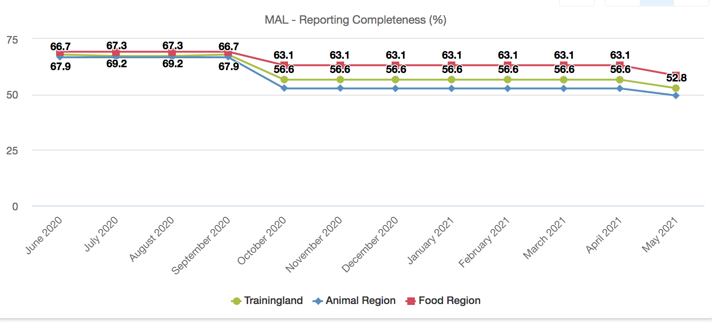

### Table 1: Reporting completeness in public and private sector

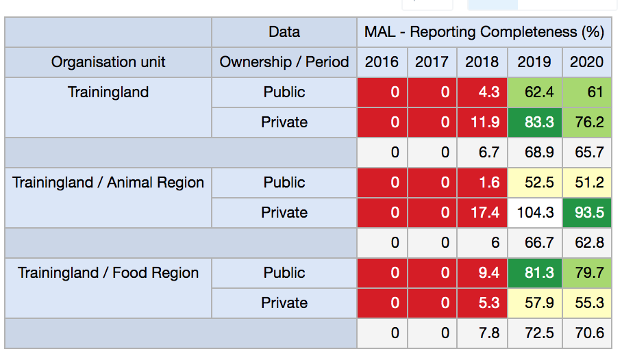

### Chart 2: Reporting timeliness

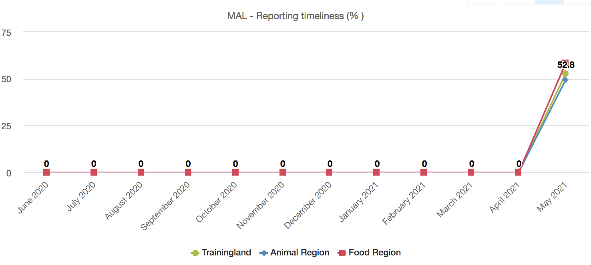

### Table 2: Reporting timeliness in private and public sector

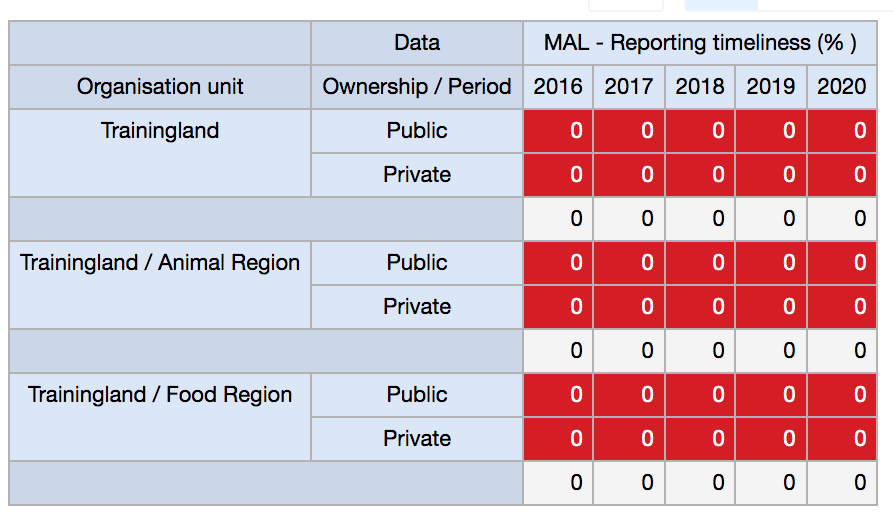

### Table 3: Completeness of variable in actual reports

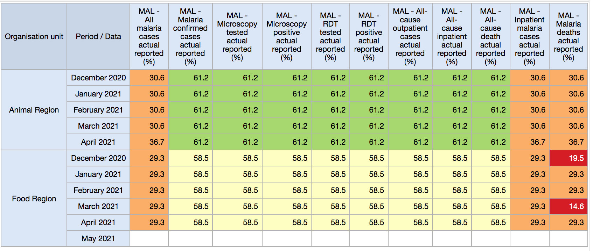

### Table 4: Consistency between variables

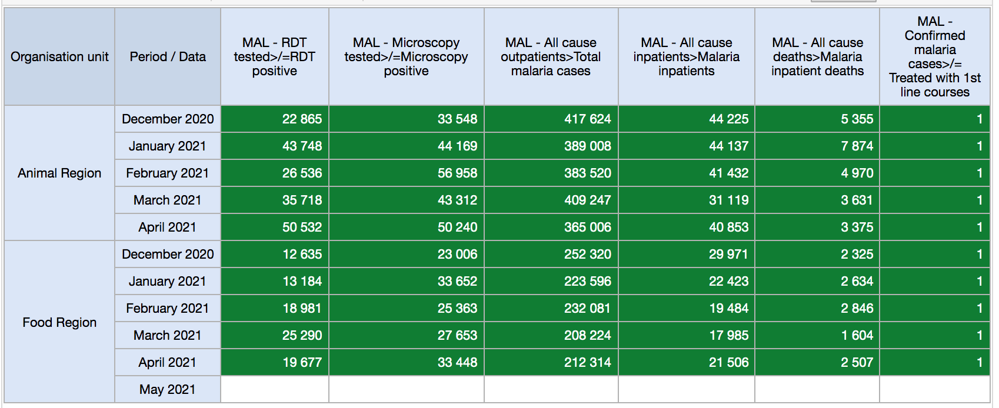

### Chart 3: Proportion of outpatient malaria cases

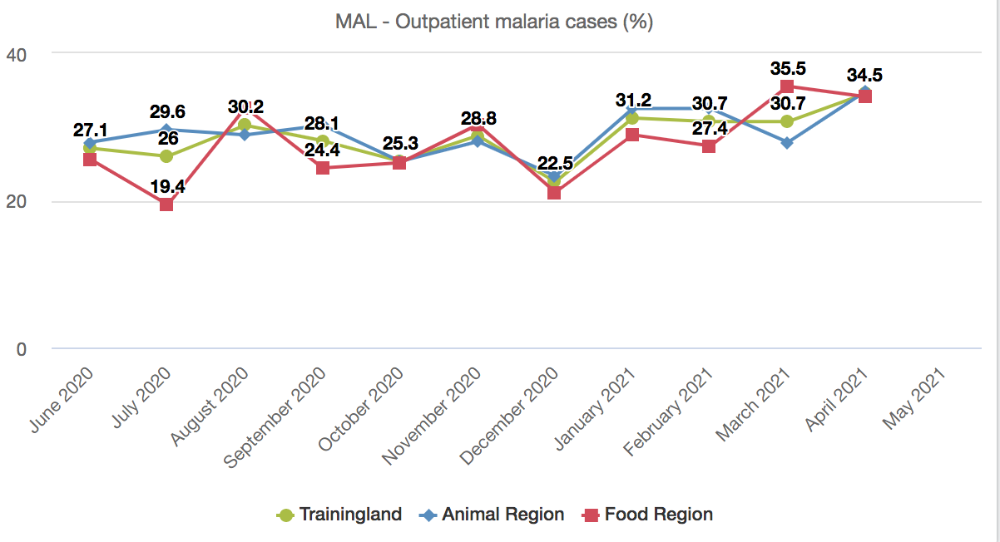

### Chart 4: Proportion of inpatient malaria cases

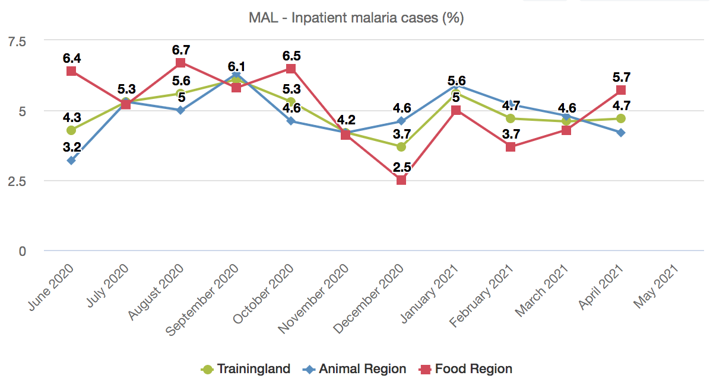

### Chart 5: Proportion of inpatient deaths

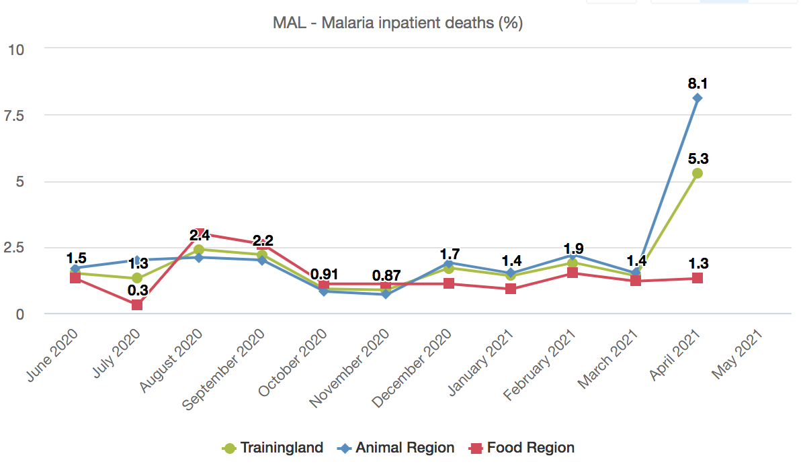

### Chart 6: Test positivity rate

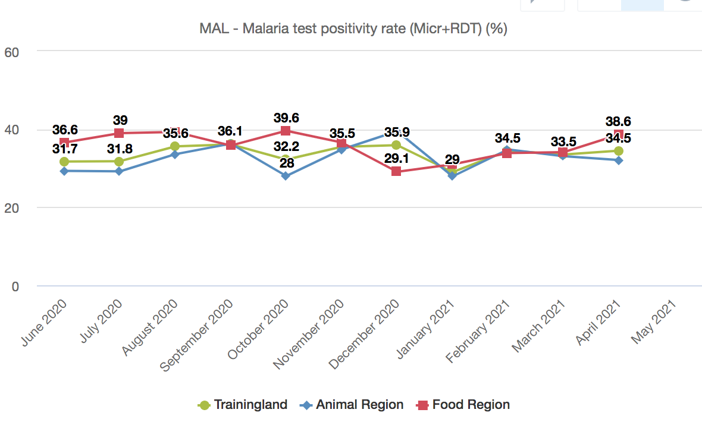

### Chart 7: Slide positivity rate

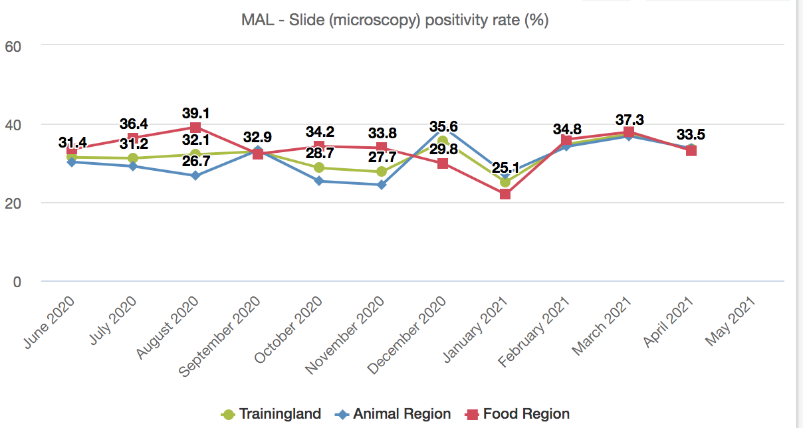

### Chart 8: RDT positivity rate

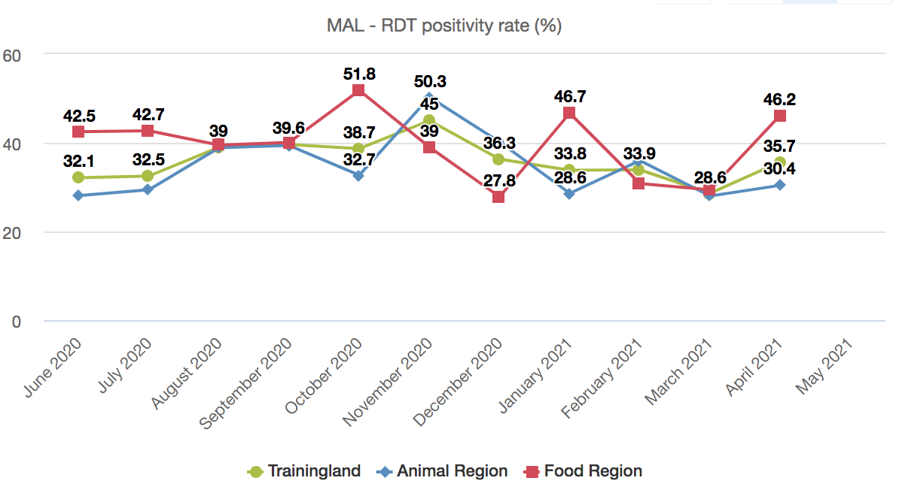

### Chart 9: Proportion of suspected individuals tested

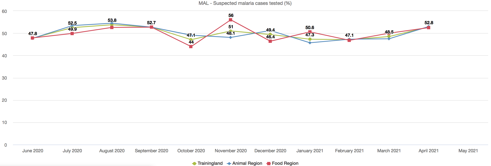

## Dashboard

All data visualization items created have been configured on a single dashboard named 'Malaria Data Quality' and below is a snapshot of the dashboard with some of the items as displayed. By default, the Malaria Data Quality dashboard within the package is configured to be shared with the User Group 'Malaria access', which is the same user group used to provide access to dashboards in the Burden Reduction package.

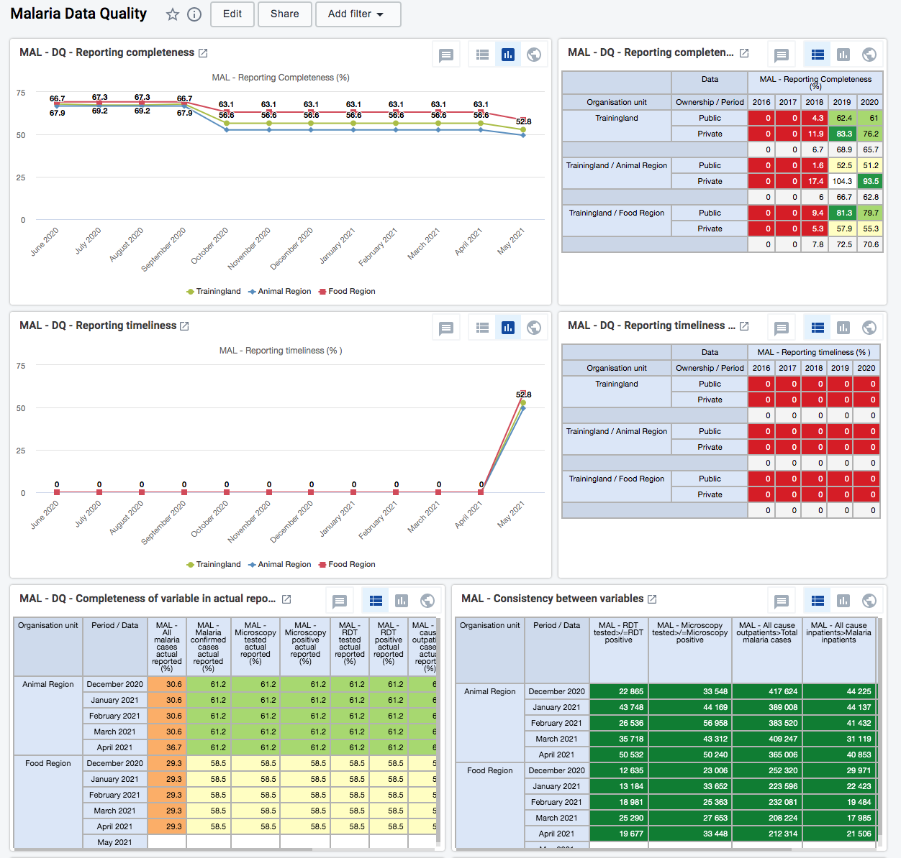
