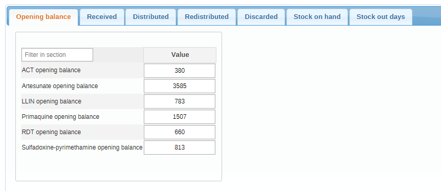
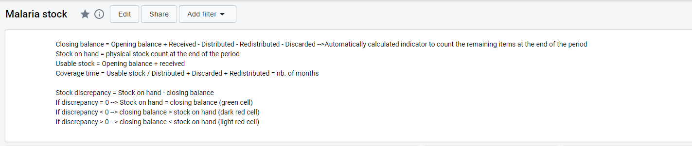
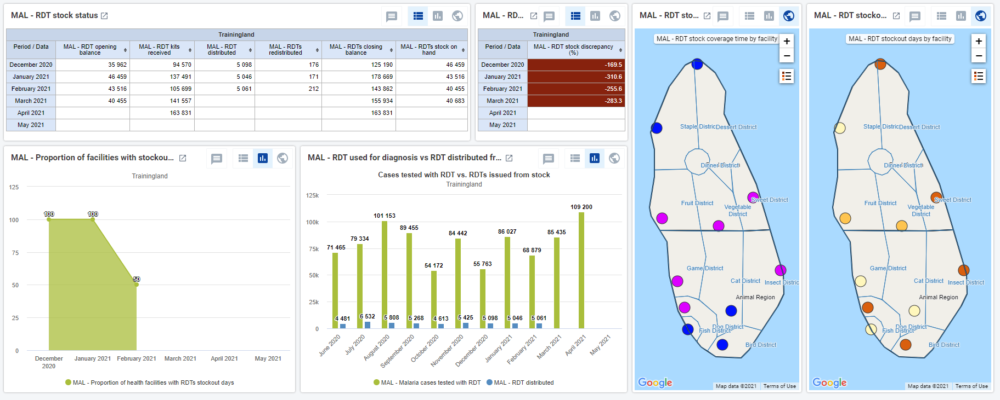

# Malaria logistics

## Malaria logistics design

The logistics metadata is designed to be harmonized conceptually across different health programmes. To ease the adoption of these packages in countries, we have included the program-specific metadata into existing DHIS2 metadata for Malaria programmes. The aggregate HMIS package for malaria therefore includes:

1. Dashboards with visualizations and charts combining health services (HMIS) indicators and key logistics performance indicators (LMIS)
2. Indicators and predictors to generate calculated values as part of the common logistics metadata framework and core performance monitoring indicators for logistics as part of overall programme management

3. Data sets and data elements for facility reporting of logistics data, pre-configured for a set of typical stock items monitored for malaria programmes

### Intended users

- **Health facility users**: capture and report key logistics data for specific health programs. The Facility Stock Report is generally used by pharmacists and storekeepers for recording all essential stock data at the health care facility at the end of every month. Storekeepers maintain their usual paper documentation such as stock cards and bin cards for recording stock receipts and stock issues. At the end of every month, data from these records is entered into DHIS2 for sharing data.

- **National and sub-national (e.g. district level) programme managers**: for monitoring overall health programme performance, analyzing and cross-referencing logistics and health service delivery data to make informed decisions about programmatic interventions

### Data Sets

Different stock data sets have been configured for each vertical health programme. The decision to create a new dataset instead of including on the HMIS data entry form was taken because:

1. Different users may be responsible for entering stock data or programmatic/health service data at the facility level. Access can be controlled by assigning user groups to the data sets.
2. It is possible to monitor completeness of stock reporting vs. completeness of health services reporting.

It is recommended that the dataset is assigned to Organisation Units **at the lowest level** of the health system feasible for reporting data, such as health facilities or community health workers.

### Data Entry Form (facility stock reporting)

After selecting the required Organization Unit and selecting the "Facility Stock Report" Data Set a separate table for reporting logistics data will be displayed.

The list of items will be the same throughout the different tabs.

The "Opening balance" field will automatically display the Stock on hand from the last day of the previous month.

At the end of every month, the storekeeper will add up the totals for the "Stocks received", "Stocks issued", "Stocks discarded" as well as "Stocks redistributed" during the entire reporting period and record them in DHIS2 for each health product.

The storekeeper then carries out a complete physical stock count of all health products and records the respective stock on hand (total quantity which is physically available in the medical store) in DHIS2.

DHIS2 will calculate the "Closing balance" instantly as values are entered in the Data Entry form. Note that the calculation result will only be correct once all values for the health product have been recorded.

Finally, the storekeeper will review the stock records and count the number of days during the reporting period on which the respective health product was out of stock at any time or for any period of the day.

### Malaria logistics analytics

The malaria logistics configuration supports core/cross-cutting logistics indicators described in the common metadata framework and logistics performance monitoring indicators. From the data captured, we can also calculate the following indicators which are recommended by the WHO Global Malaria Programme for integrated analysis alongside indicators contained in the WHO HMIS health programmes packages.

| LMIS Malaria Indicator                                              | Numerator                                                               | Denominator                                                                          |
|---------------------------------------------------------------------|-------------------------------------------------------------------------|--------------------------------------------------------------------------------------|
| RDT stock discrepancy (%)                                           | stock on hand-(received+opening balance-discarded-issued-redistributed) | stock on hand                                                                        |
| Health facilities with ACT stock-out days (%)                       | facilities with stock-out days reported                                 | Facilities with stock-out days reported + facilities without stock-out days reported |
| ACT Stock coverage time                                             | opening balance + received                                              | discarded + issued + redistributed                                                   |
| Sulfadoxine-pyrimethamine wastage rate (%)                          | (closing balance - stock on hand) + discarted                           | closing balance - stock on hand + discarted + issued                                 |
| PMQ stock coverage time                                             | opening balance + received                                              | discarded + issued + redistributed                                                   |
| LLIN stock discrepancy (%)                                          | stock on hand-(received+opening balance-discarded-issued-redistributed) | stock on hand                                                                        |
| Artesunate stock discrepancy (%)                                    | stock on hand-(received+opening balance-discarded-issued-redistributed) | stock on hand                                                                        |
| Primaquine stock discrepancy %)                                     | stock on hand-(received+opening balance-discarded-issued-redistributed) | stock on hand                                                                        |
| ACT wastage rate (%)                                                | (closing balance - stock on hand) + discarted                           | closing balance - stock on hand + discarted + issued                                 |
| Health facilities with LLIN stock-out days (%)                      | facilities with stock-out days reported                                 | Facilities with stock-out days reported + facilities without stock-out days reported |
| Primaquine wastage rate (%)                                         | (closing balance - stock on hand) + discarted                           | closing balance - stock on hand + discarted + issued                                 |
| ACT stock discrepancy (%)                                           | stock on hand-(received+opening balance-discarded-issued-redistributed) | stock on hand                                                                        |
| RDTs wastage rate (%)                                               | (closing balance - stock on hand) + discarted                           | closing balance - stock on hand + discarted + issued                                 |
| Health facilities with sulfadoxine-pyrimethamine stock-out days (%) | facilities with stock-out days reported                                 | Facilities with stock-out days reported + facilities without stock-out days reported |
| LLIN coverage time                                                  | opening balance + received                                              | discarded + issued + redistributed                                                   |
| LLIN wastage rate (%)                                               | (closing balance - stock on hand) + discarted                           | closing balance - stock on hand + discarted + issued                                 |
| Health facilities with Artesunate stock-out days (%)                | facilities with stock-out days reported                                 | Facilities with stock-out days reported + facilities without stock-out days reported |
| SX-PYR stock coverage time                                          | opening balance + received                                              | discarded + issued + redistributed                                                   |
| Artesunate wastage rate (%)                                         | (closing balance - stock on hand) + discarted                           | closing balance - stock on hand + discarted + issued                                 |
| RDTs stock coverage time                                            | opening balance + received                                              | discarded + issued + redistributed                                                   |
| ART stock coverage time                                             | opening balance + received                                              | discarded + issued + redistributed                                                   |
| Health facilities with RDT stock-out days (%)                       | facilities with stock-out days reported                                 | Facilities with stock-out days reported + facilities without stock-out days reported |
| Sulfadoxine-pyrimethamine stock discrepancy (%)                     | stock on hand-(received+opening balance-discarded-issued-redistributed) | stock on hand                                                                        |

### HMIS-LMIS data triangulation

Some of the HMIS data points and indicators can be compared against LMIS data points and indicators. This allows a data analytics user to identify discrepancies between health services delivered and expected stock issued, such as to flag potential data quality errors. This also enables users to do ad hoc analysis such as to monitor the trend of malaria cases tested and RDTs issued against data points like % of cases receiving a diagnostic test, to identify programmatic issues that may be attributed to stock management.

|                  HMIS                  |        LMIS       |
|:--------------------------------------:|:-----------------:|
| MAL - Malaria cases tested with RDT    | MAL - RDTs issued |
| MAL - COnfirmed cases treated with ACT | MAL - ACT issued  |

### Stock Dashboard

The dashboard has a first dialog window with some key definitions to facilitate the reading and interpretation of the data.

The structure is consistent throughout the dashboard:

- A table with the stock status of the item

- A table with the stock discrepancy - see the dialog window for the colour legend

- A map with the stock coverage time for the item

- A map with the stock-out days of the item by facility

- A graph with the proportion of facilities reporting stock-out days

Extra items will be available depending on the possibility to triangulate HMIS vs LMIS data.

### Validation

The following data validation rules have been configured to support high quality collection of stock data:

| Name                                                                                                                              | Instruction                                                                                                                                                | Operator              | LeftSide                                | RightSide                                                                        |
|-----------------------------------------------------------------------------------------------------------------------------------|------------------------------------------------------------------------------------------------------------------------------------------------------------|-----------------------|-----------------------------------------|----------------------------------------------------------------------------------|
| MAL -   Sulfadoxine-pyrimethamine distributed<=Sulfadoxine-pyrimethamine opening   balance + Sulfadoxine-pyrimethamine received   | Sulfadoxine-pyrimethamine   distributed should be less than or equal to Sulfadoxine-pyrimethamine opening   balance + Sulfadoxine-pyrimethamine received   | less_than_or_equal_to | Sulfadoxine-pyrimethamine   distributed | Sulfadoxine-pyrimethamine   opening balance + Sulfadoxine-pyrimethamine received |
| MAL - RDT stock out days <=30 days                                                                                                | RDT stock out days should be less than or   equal to 30 days                                                                                               | less_than_or_equal_to | Stock out days                          | 30 days                                                                          |
| MAL - RDTs drugs distributed<=RDT   opening balance + RDTs received                                                               | RDTs drugs distributed should be less   than or equal to RDT opening balance + RDTs received                                                               | less_than_or_equal_to | RDTs drugs distributed                  | RDT opening balance + RDTs received                                              |
| MAL - Sulfadoxine-pyrimethamine   discarded<=Sulfadoxine-pyrimethamine opening balance +   Sulfadoxine-pyrimethamine received     | Sulfadoxine-pyrimethamine discarded   should be less than or equal to Sulfadoxine-pyrimethamine opening balance +   Sulfadoxine-pyrimethamine received     | less_than_or_equal_to | Sulfadoxine-pyrimethamine discarded     | Sulfadoxine-pyrimethamine opening balance   + Sulfadoxine-pyrimethamine received |
| MAL - ACTs redistributed<=ACT opening   balance + ACTs courses received                                                           | ACTs redistributed should be less than or   equal to ACT opening balance + ACTs courses received                                                           | less_than_or_equal_to | ACTs redistributed                      | ACT opening balance + ACTs courses   received                                    |
| MAL - Primaquine   distributed<=Primaquine opening balance + Primaquine received                                                  | Primaquine distributed should be less   than or equal to Primaquine opening balance + Primaquine received                                                  | less_than_or_equal_to | Primaquine distributed                  | Primaquine opening balance + Primaquine   received                               |
| MAL - Artesunate   distributed<=Artesunate opening balance + Artesunate received                                                  | Artesunate distributed should be less   than or equal to Artesunate opening balance + Artesunate received                                                  | less_than_or_equal_to | Artesunate distributed                  | Artesunate opening balance + Artesunate   received                               |
| MAL - ACTs distributed<=ACT opening   balance + ACTs courses received                                                             | ACTs distributed should be less than or   equal to ACT opening balance + ACTs courses received                                                             | less_than_or_equal_to | ACTs distributed                        | ACT opening balance + ACTs courses   received                                    |
| MAL - Primaquine   redistributed<=Primaquine opening balance + Primaquine received                                                | Primaquine redistributed should be less   than or equal to Primaquine opening balance + Primaquine received                                                | less_than_or_equal_to | Primaquine redistributed                | Primaquine opening balance + Primaquine   received                               |
| MAL - Artesunate  stock out days <= 30 days                                                                                       | Artesunate stock out days should be less   than or equal to  30 days                                                                                       | less_than_or_equal_to |  Stock out days                         | 30 days                                                                          |
| MAL - RDT stock on hand<=RDT opening   balance + RDTs received                                                                    | RDT stock on hand should be less than or   equal to RDT opening balance + RDTs received                                                                    | less_than_or_equal_to | RDT stock on hand                       | RDT opening balance + RDTs received                                              |
| MAL - ACT stock on hand<=ACT opening   balance + ACTs courses received                                                            | ACT stock on hand should be less than or   equal to ACT opening balance + ACTs courses received                                                            | less_than_or_equal_to | ACT stock on hand                       | ACT opening balance + ACTs courses   received                                    |
| MAL - Artesunate   redistributed<=Artesunate opening balance + Artesunate received                                                | Artesunate redistributed should be less   than or equal to Artesunate opening balance + Artesunate received                                                | less_than_or_equal_to | Artesunate redistributed                | Artesunate opening balance + Artesunate   received                               |
| MAL - Artesunate stock on   hand<=Artesunate opening balance + Artesunate received                                                | Artesunate stock on hand should be less   than or equal to Artesunate opening balance + Artesunate received                                                | less_than_or_equal_to | Artesunate stock on hand                | Artesunate opening balance + Artesunate   received                               |
| MAL - Sulfadoxine-pyrimethamine   redistributed<=Sulfadoxine-pyrimethamine opening balance +   Sulfadoxine-pyrimethamine received | Sulfadoxine-pyrimethamine redistributed   should be less than or equal to Sulfadoxine-pyrimethamine opening balance +   Sulfadoxine-pyrimethamine received | less_than_or_equal_to | Sulfadoxine-pyrimethamine redistributed | Sulfadoxine-pyrimethamine opening balance   + Sulfadoxine-pyrimethamine received |
| MAL - Artesunate discarded<=Artesunate   opening balance + Artesunate received                                                    | Artesunate discarded should be less than   or equal to Artesunate opening balance + Artesunate received                                                    | less_than_or_equal_to | Artesunate discarded                    | Artesunate opening balance + Artesunate   received                               |
| MAL - Primaquine  stock out days<=30 days                                                                                         | Primaquine stock out days should be less   than or equal to 30 days                                                                                        | less_than_or_equal_to |  Stock out days                         | 30 days                                                                          |
| MAL - ACT stock out days<=30 days                                                                                                 | ACT stock out days should be less than or   equal to 30 days                                                                                               | less_than_or_equal_to |  Stock out days                         | 30 days                                                                          |
| MAL - Sulfadoxine-pyrimethamine  stock out days <=30 days                                                                         | Sulfadoxine-pyrimethamine  stock out days should be less than or equal   to 30 days                                                                        | less_than_or_equal_to |  Stock out days                         | 30 days                                                                          |
| MAL - LLIN redistributed<=LLIN opening   balance + LLIN received                                                                  | LLIN redistributed should be less than or   equal to LLIN opening balance + LLIN received                                                                  | less_than_or_equal_to | LLIN redistributed                      | LLIN opening balance + LLIN received                                             |
| MAL - RDTs redistributed<=RDT opening   balance + RDTs received                                                                   | RDTs redistributed should be less than or   equal to RDT opening balance + RDTs received                                                                   | less_than_or_equal_to | RDTs redistributed                      | RDT opening balance + RDTs received                                              |
| MAL - Sulfadoxine-pyrimethamine stock on   hand<=Sulfadoxine-pyrimethamine opening balance +   Sulfadoxine-pyrimethamine received | Sulfadoxine-pyrimethamine stock on hand   should be less than or equal to Sulfadoxine-pyrimethamine opening balance +   Sulfadoxine-pyrimethamine received | less_than_or_equal_to | Sulfadoxine-pyrimethamine stock on hand | Sulfadoxine-pyrimethamine opening balance   + Sulfadoxine-pyrimethamine received |
| MAL - Primaquine stock on   hand<=Primaquine opening balance + Primaquine received                                                | Primaquine stock on hand should be less   than or equal to Primaquine opening balance + Primaquine received                                                | less_than_or_equal_to | Primaquine stock on hand                | Primaquine opening balance + Primaquine   received                               |
| MAL - LLIN  stock out days <=30 days                                                                                              | LLIN    stock out days should be less than or equal to 30 days                                                                                             | less_than_or_equal_to |  Stock out days                         | 30 days                                                                          |
| MAL - ACT discarded<=ACT opening   balance + ACTs courses received                                                                | ACT discarded should be less than or   equal to ACT opening balance + ACTs courses received                                                                | less_than_or_equal_to | ACT discarded                           | ACT opening balance + ACTs courses   received                                    |
| MAL - LLIN stock on hand<=LLIN opening   balance + LLIN received                                                                  | LLIN stock on hand should be less than or   equal to LLIN opening balance + LLIN received                                                                  | less_than_or_equal_to | LLIN stock on hand                      | LLIN opening balance + LLIN received                                             |
| MAL - RDTs discarded<=RDT opening   balance + RDTs received                                                                       | RDTs discarded should be less than or   equal to RDT opening balance + RDTs received                                                                       | less_than_or_equal_to | RDTs discarded                          | RDT opening balance + RDTs received                                              |
| MAL - Primaquine discarded<=Primaquine   opening balance + Primaquine received                                                    | Primaquine discarded should be less than   or equal to Primaquine opening balance + Primaquine received                                                    | less_than_or_equal_to | Primaquine discarded                    | Primaquine opening balance + Primaquine   received                               |
| MAL - LLIN discarded<=LLIN opening   balance + LLIN received                                                                      | LLIN discarded should be less than or   equal to LLIN opening balance + LLIN received                                                                      | less_than_or_equal_to | LLIN discarded                          | LLIN opening balance + LLIN received                                             |
| MAL - LLIN distributed<=LLIN opening   balance + LLIN received                                                                    | LLIN distributed should be less than or   equal to LLIN opening balance + LLIN received                                                                    | less_than_or_equal_to | LLIN distributed                        | LLIN opening balance + LLIN received                                             |

### User Groups

In addition to the regular Admin and access user profiles, the LMIS dataset brings an extra user group.

Stock data capture: designed to enable access to the facility level reporter that is responsible for stock reporting; depending on local context, this may or may not be the same person that is responsible for monthly reporting of health services data  --> **Malaria stock data capture**

Please refer to the installation guidance for more information on the other user groups.

### Customizing Data Entry Forms

The dataset in this package does not contain a custom form. However, many countries may require a custom form interface to more closely match paper records and forms used in countries; and to facilitate a more intuitive user interace for the data entry user. To improve the usability of the form for data entry, implementers may design a custom form to meet their needs by following the DHIS2 User manual: [Manage Custom Forms](#manage_customform)
